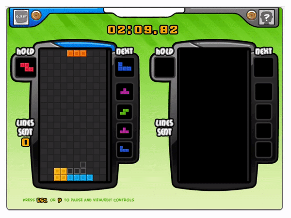
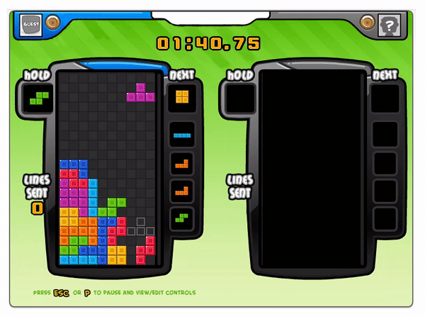
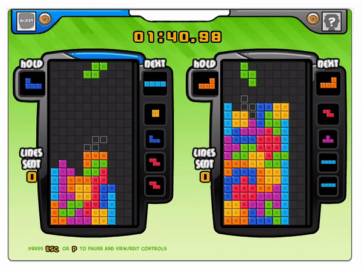

# **TetrisBattle SinglePlayerAI**

This Ai (OnePlayerAi.py) - [Demo](#**Demo**)- is made to work with this version of Tetris. I edited some of main projects files: the settings.py, tetris_interface.py, tetris.py, tetris.env to better fit the provided AI. To run the projects follow [this](#***requirements***).


# **TetrisBattle The game**

This project is to reproduce the popular Facebook game -- Tetris Battle (Not available playing online now). I also offer the environment of the game for training AI agent.

It is a highly restored version of original game, with features as follow: <br/>
- 2 players <br/>
- UI  <br/>
- T spin and Tetris <br/>
- back to back <br/>
- garbage lines <br/>
- alarm for attacks <br/>

Note that some of them are credited to https://github.com/xuyuwei/tetris-battle. and to https://github.com/ylsung/TetrisBattle

The repository contains:

1. Single player mode
2. Two players mode
3. AI mode

## **Demo**


### AI 
demo of the AI:




### Single player mode

demo the fuctions: tspin and back to back.



### Two players mode

demo the functions: tetris, combo and ko.




## **Requirements**
```
python3 
pygame 
Linux system 
```

Note that pygame might have conflicts with macOS. <br/>

In my case, the program works well on macOS 10.14.6 with `pygame==2.0.0.dev1` and `python==3.7.4`. However, it breaks with `pygame==1.9.4`.

## **Installation**
```
python setup.py develop
```

## **Usage**

### Single player mode

```
python -m game.tetris_game --mode single
```

### Two players mode

```
python -m game.tetris_game --mode double
```

### AI mode

```
python OnePlayerAi.py
```

## **Disclaimer**

This work is based on the following repos: <br/>
1. https://github.com/xuyuwei/tetris-battle
2. https://github.com/ylsung/TetrisBattle

## **Contact**
Mohammad Alkhalifah, malkhalifah@ucsd.edu